# ATS Parsing & Interview Question Generation Backend Flow

This document details how the backend processes ATS Resume Evaluation and dynamically generates Interview Questions using Gemini AI, outlining the roles of key backend files and the sequence flow.

---

## Architectural Diagram

The sequence diagram below displays the two distinct flows:
1. **ATS Evaluation Flow**: How a candidate's resume is uploaded and parsed against a job description.
2. **Campaign Question Generation Flow**: How an organization sets up a campaign and uses Gemini to generate tailored questions.

```mermaid
sequenceDiagram
    autonumber
    
    %% ATS Flow
    rect rgb(23, 23, 37)
        Note over User/Org, Gemini: 1. ATS RESUME EVALUATION FLOW
        actor User/Org as Candidate / HR User
        participant ATSRouter as routers/ats.py
        participant ATSService as db/services/ats_service.py
        participant Gemini as Gemini AI API (gemini-2.5-flash)

        User/Org->>ATSRouter: POST /api/v1/ats/evaluate<br/>(resume_file, job_desc_file/text)
        activate ATSRouter
        ATSRouter->>ATSRouter: Save files temporarily on local disk
        ATSRouter->>ATSService: extract_text(file_path)
        activate ATSService
        Note over ATSService: Extract text via PyMuPDF (PDF)<br/>or python-docx (DOCX)
        ATSService-->>ATSRouter: return text strings
        deactivate ATSService
        
        ATSRouter->>ATSService: get_ats_score(resume_text, jd_text)
        activate ATSService
        ATSService->>Gemini: generate_content(prompt)
        activate Gemini
        Gemini-->>ATSService: Return JSON string
        deactivate Gemini
        ATSService-->>ATSRouter: Return structured parsed dict
        deactivate ATSService
        
        ATSRouter->>ATSRouter: Clean up temporary files
        ATSRouter-->>User/Org: HTTP 200 OK (percentage match, missing keywords, suggestions)
        deactivate ATSRouter
    end

    %% Question Generation Flow
    rect rgb(30, 41, 59)
        Note over Org, DB: 2. INTERVIEW QUESTION GENERATION FLOW
        actor Org as Organization (HR/Recruiter)
        participant CampaignRouter as routers/campaign.py
        participant QuestionService as db/services/question_service.py
        participant DB as db/models/interview.py (InterviewQuestion)

        Org->>CampaignRouter: POST /api/v1/campaigns/{id}/generate-questions<br/>(num_questions, question_type, difficulty)
        activate CampaignRouter
        CampaignRouter->>CampaignRouter: Verify Org owns Campaign (JobRole)
        
        CampaignRouter->>QuestionService: generate_questions_for_role(job_role, num, type, diff)
        activate QuestionService
        QuestionService->>Gemini: generate_content(prompt with role, skills, experience)
        activate Gemini
        Gemini-->>QuestionService: Return JSON array of questions
        deactivate Gemini
        QuestionService-->>CampaignRouter: Return structured list[dict]
        deactivate QuestionService
        
        CampaignRouter->>DB: Delete existing questions for job role
        CampaignRouter->>DB: Bulk insert new InterviewQuestion records<br/>(question_text, type, expected_answer, keywords)
        CampaignRouter-->>Org: HTTP 200 OK (List of saved Interview Questions)
        deactivate CampaignRouter
    end
```



---

## File Breakdown and Functions

Here is the directory structure showing the location of these components:

```
backend/app/
├── cv/
├── db/
│   └── services/
│       ├── ats_service.py        # Resume parsing & Gemini scoring
│       └── question_service.py   # AI interview question generation
├── db/
│   └── models/
│       └── interview.py          # Database models (Interview, InterviewQuestion, InterviewResponse)
└── routers/
    ├── ats.py                    # ATS Upload and evaluation endpoint
    ├── campaign.py               # Campaign creation and question generation trigger
    └── interview.py              # Candidate execution and score aggregation
```

### 1. `app/routers/ats.py`
[ats.py](file:///d:/PROJECTS/ai_interview_analysis/Ai_interview_Latest/AI-Interview/backend/app/routers/ats.py)
- **Function**: Exposes the ATS scan router under the `/ats` prefix.
- **Workflow**:
  - Validates that either a job description file or raw text is supplied.
  - Temporarily saves files (PDF, DOC, DOCX, TXT) to the temporary uploads folder.
  - Invokes `extract_text` to convert the binary formats into raw strings.
  - Submits the raw strings to `get_ats_score`.
  - Removes the temporary files from the server and outputs the JSON response mapping the candidate's alignment.

### 2. `app/db/services/ats_service.py`
[ats_service.py](file:///d:/PROJECTS/ai_interview_analysis/Ai_interview_Latest/AI-Interview/backend/app/db/services/ats_service.py)
- **Function**: Core service utility for extracting document text and communicating with Gemini AI.
- **Details**:
  - `extract_text()`: Uses `fitz` (PyMuPDF) to read PDF nodes, and `docx` (`python-docx`) to read paragraph blocks.
  - `get_ats_score()`: Builds an HR prompt containing the resume content and the job description, prompts the `gemini-2.5-flash` model, and cleanses the markdown block return format to supply structured JSON keys (`percentage_match`, `missing_keywords`, `suggestions`, and `final_thoughts`).

### 3. `app/routers/campaign.py`
[campaign.py](file:///d:/PROJECTS/ai_interview_analysis/Ai_interview_Latest/AI-Interview/backend/app/routers/campaign.py)
- **Function**: Connects Campaign configurations (`JobRole`) with AI question generation.
- **Workflow**:
  - Exposes the `/campaigns/{id}/generate-questions` route.
  - Assures authorization boundaries (only the owning Organization can generate questions for their campaign).
  - Fetches the campaign's metadata (title, skills, experience requirements) and prompts `question_service.py`.
  - Flushes any prior questions for that role from the database, and adds the newly generated collection to the `InterviewQuestion` table.

### 4. `app/db/services/question_service.py`
[question_service.py](file:///d:/PROJECTS/ai_interview_analysis/Ai_interview_Latest/AI-Interview/backend/app/db/services/question_service.py)
- **Function**: Uses LLM prompt engineering to formulate custom interview questions.
- **Details**:
  - Forms a prompt summarizing the job requirements and desired difficulty.
  - Instructs `gemini-2.5-flash` to return a list of JSON records, generating for each question:
    1. Question text.
    2. Question type classification (`technical`, `behavioral`, `situational`).
    3. An `expected_answer` (model answer representing an ideal response).
    4. A list of `expected_answer_keywords` used by the scoring engine later.

### 5. `app/routers/interview.py` & `app/db/models/interview.py`
[interview.py](file:///d:/PROJECTS/ai_interview_analysis/Ai_interview_Latest/AI-Interview/backend/app/routers/interview.py) | [models/interview.py](file:///d:/PROJECTS/ai_interview_analysis/Ai_interview_Latest/AI-Interview/backend/app/db/models/interview.py)
- **Function**: Controls the runtime execution of candidate interviews.
- **Details**:
  - When the candidate hits `POST /interviews/{id}/complete`, the backend loads all responses submitted (`DBInterviewResponse`) and averages their ratings to compute `interview_score`.
  - If proctoring data exists for the session, it calculates the **Final Weighted Score**:
    $$\text{Final Score} = 0.4 \times \text{Answer Quality} + 0.2 \times \text{Integrity} + 0.2 \times \text{Attention} + 0.2 \times \text{Confidence}$$
  - If no proctoring data is present, it uses the candidate's ATS resume match score:
    $$\text{Final Score} = 0.3 \times \text{ATS Score} + 0.7 \times \text{Answer Quality}$$
