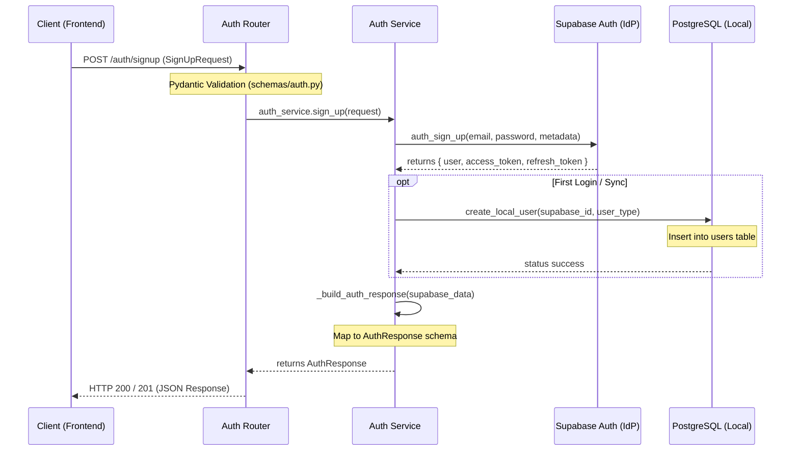

# Authentication Overview

This document provides a high-level overview of the authentication system in the AI Interview Analysis backend.

## Architecture

The system uses a **hybrid authentication architecture**:

1.  **Supabase Auth**: Acts as the primary Identity Provider (IdP). It handles user registration, password security, email verification, and OAuth (Google) integrations. It issues JWT tokens (Access and Refresh).
2.  **Local Database (PostgreSQL)**: Stores application-specific metadata and relationships (e.g., Organization/Candidate profiles) linked by the Supabase `user_id` (UUID).

## Key Components

- **[Auth Router](../app/routers/auth.py)**: Defines the FastAPI endpoints.
- **[Auth Service](../app/db/services/auth_service.py)**: Orchestrates calls between Supabase and the local database.
- **[User Model](../app/db/models/user.py)**: The local representation of a user.
- **[Auth Schemas](../app/schemas/auth.py)**: Pydantic models for request/response validation.

---

## Request Lifecycle Map

The following map illustrates how a typical authentication request (e.g., `/signup`) is processed:

### Visual Request Map (Text-based)

```text
[ Client (Frontend) ]
        |
        | 1. POST /signup (SignUpRequest)
        v
[ Auth Router ] <------ (Pydantic Validation: schemas/auth.py)
        |
        | 2. auth_service.sign_up()
        v
[ Auth Service ] -------------------> [ Supabase Auth (IdP) ]
        |       3. auth_sign_up()              |
        |                                      | 4. Return Session
        | <------------------------------------|
        |
        | 5. If new User -> [ PostgreSQL (Local DB) ]
        |                   (create_local_user)
        |
        | 6. Map to AuthResponse schema
        v
[ Auth Router ]
        |
        | 7. HTTP 200/201 (JSON Response)
        v
[ Client (Frontend) ]
```

### Sequence Diagram (Requires Mermaid enabled viewer)



### Step-by-Step Request Flow:

1.  **Client Request**: The frontend sends a JSON payload to an endpoint like `/auth/signup`.
2.  **Schema Validation**: FastAPI uses Pydantic ([schemas/auth.py](../app/schemas/auth.py)) to ensure the email is valid, password meets length requirements, and `user_type` is one of `organization`, `candidate`, or `admin`.
3.  **Service Orchestration**: The [Auth Router](../app/routers/auth.py) passes the validated data to the [Auth Service](../app/db/services/auth_service.py).
4.  **External Identity (Supabase)**: The service communicates with Supabase Auth via HTTP. Supabase handles the heavy lifting of password hashing and identity management.
5.  **Local Sync**: Once Supabase confirms success, the service creates a mirroring record in our local PostgreSQL `users` table along with any specific profiles (Candidate/Organization).
6.  **Response Construction**: The service transforms the Supabase data into our internal `AuthResponse` format.
7.  **Final Response**: FastAPI serializes the object to JSON and returns it to the Client with the appropriate HTTP status code.

---

## Authentication Flow

### 1. User Signup (`/auth/signup`)

1.  Frontend sends `SignUpRequest` (email, password, user_type).
2.  `AuthService` calls Supabase `auth_sign_up`.
3.  Supabase creates the user and triggers an email verification (if configured).
4.  The `user_type` is stored in Supabase `user_metadata`.
5.  _Note: A local record in the `users` table is typically created upon first login or via webhook/callback._

### 2. User Signin (`/auth/signin`)

1.  Frontend sends credentials.
2.  Supabase validates and returns a JWT session.
3.  The response includes an `access_token` and `refresh_token`.

### 3. Google OAuth Flow (`/auth/google`)

1.  Request URL for Google login with a specified `user_type`.
2.  Supabase handles the OAuth handshake.
3.  The callback (`/auth/callback/google`) exchanges the code for a session.

---

## User Types and Validation

The system strictly enforces three user types:

- **`organization`**: For recruiters and hiring managers.
- **`candidate`**: For job seekers taking interviews.
- **`admin`**: For platform administrators.

Validation is handled at two levels:

- **API Level**: Using Pydantic's `Literal` in [app/schemas/auth.py](../app/schemas/auth.py).
- **Database Level**: Using Python's `Enum` class in [app/db/models/user.py](../app/db/models/user.py).

---

## Session Management

- **Access Tokens**: Short-lived JWTs passed in the `Authorization: Bearer <token>` header.
- **Refresh Tokens**: Used to obtain new access tokens via the `/auth/refresh` endpoint without re-authenticating.
- **Signout**: Invalidates the current session on the Supabase side.

## Security Controls

- **Password Policies**: Managed via Supabase configuration.
- **Token Verification**: Incoming requests are validated against Supabase's public keys or via the `get_current_user` utility.
- **CORS**: Configured in `settings.py` to allow only trusted frontend origins.
