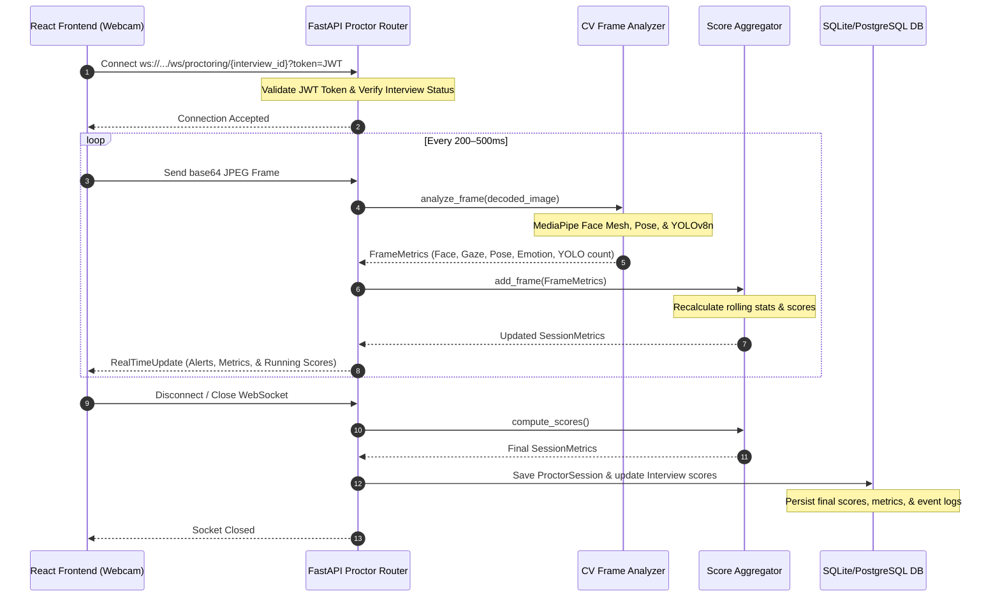

# Video Proctoring & Behavior Analysis (Computer Vision)

This document provides a comprehensive overview of the **AI Video Proctoring and Behavior Analysis Engine** in the AI Interview Analysis backend. It details the architecture, real-time data flow, underlying machine learning models, proctoring metrics, scoring algorithms, and database integration.

---

## 1. System Architecture & Data Flow

The proctoring system utilizes a real-time, low-latency, WebSocket-based pipeline to process candidate webcam frames and output instant behavior feedback while accumulating statistics for a final report.



---

## 2. Core Analysis Components & AI/ML Models

The backend employs three main Computer Vision libraries/models to analyze candidate behavior, which are **lazy-loaded** to optimize startup speed and memory consumption.

### 2.1 MediaPipe Face Mesh
* **Purpose**: Face detection, Eye gaze tracking, Head pose estimation, and Emotion analysis.
* **Refinement**: Loaded with `refine_landmarks=True` to enable the 10 iris-specific landmarks (index `468` to `477`).
* **Tasks**:
  1. **Eye Gaze Tracking**:
     * Tracks the horizontal position of the iris centers (landmarks `468` and `477`) relative to the outer and inner corners of the eyes (`33` & `133` for left eye; `362` & `263` for right eye).
     * Computes the average horizontal gaze ratio (where `0` is extreme left, `0.5` is centered, and `1` is extreme right).
     * Flags looking away if the ratio falls outside the standard range of `[0.20, 0.80]`.
  2. **Head Pose Estimation**:
     * Extracts 6 key 3D facial landmarks: Nose tip (`1`), Chin (`152`), Left eye outer corner (`33`), Right eye outer corner (`263`), Left mouth corner (`61`), and Right mouth corner (`291`).
     * Uses OpenCV's Perspective-n-Point solver (`cv2.solvePnP`) against a 3D generic head model to estimate rotation vectors.
     * Decomposes the rotation matrix via `cv2.RQDecomp3x3` to extract degrees of **yaw** (left/right rotation), **pitch** (up/down rotation), and **roll** (tilt).
     * Flags a turned-away head if $|yaw| > 30^\circ$ or $|pitch| > 25^\circ$.
  3. **Heuristic Emotion Detection**:
     * Classifies the dominant facial emotion based on relative distances and ratios of landmarks:
       * **Surprised**: Mouth opening ratio (vertical distance between lips `13`/`14` divided by horizontal mouth width `61`/`291`) $> 0.35$.
       * **Happy (Smile)**: Mouth opening ratio $> 0.15$ with mouth width $> 0.12$.
       * **Stressed**: Furrowed brows (brow-to-eye distance `70` to `159` $< 0.02$) and narrow eyes (eyelid distance `159` to `145` $< 0.015$).
       * **Nervous**: Narrow eyes (eyelid distance $< 0.012$).
       * **Neutral**: Default/resting facial landmarks.

### 2.2 MediaPipe Pose
* **Purpose**: Posture assessment and movement stability.
* **Configuration**: Initialized with `model_complexity=0` for maximum runtime efficiency.
* **Tasks**:
  1. **Sitting Posture Quality**:
     * **Shoulder Alignment**: Difference in Y-coordinates between left and right shoulders (`LEFT_SHOULDER` and `RIGHT_SHOULDER`).
     * **Spine Straightness**: Alignment of the nose relative to the midpoint between both shoulders.
     * **Forward Lean**: Vertical distance (Y-coordinate) from the nose to the midpoint between shoulders.
     * Computes a combined posture quality score from `0` to `100`.
  2. **Excessive Movement**:
     * Tracks the Euclidean distance shift of key landmarks (nose, left/right shoulders) from the previous frame. If displacement exceeds `0.08`, it flags excessive movement.

### 2.3 YOLOv8 (Lightweight Nano Model - `yolov8n.pt`)
* **Purpose**: Object detection to verify that only a single person is in the frame.
* **Execution**: Runs inference on the frame filtering specifically for Class `0` (person) with a confidence threshold of `0.4`.
* **Tasks**:
  * Counts the total number of people in the webcam field of view.
  * If the count is $> 1$, it triggers a **Multi-person detected** alert.

---

## 3. Real-Time Proctoring Alerts

Based on the per-frame metrics returned by the CV engine, the backend generates and returns specific proctoring alerts to the client:

| Alert Message | Trigger Condition | Event Logged to DB? |
| :--- | :--- | :--- |
| **"Face not detected"** | Face landmarks are entirely missing. | Yes (`face_not_visible`) |
| **"Looking away from screen"** | Horizontal gaze ratio is $< 0.20$ or $> 0.80$. | No (transient alert) |
| **"Head turned away"** | $|yaw| > 30^\circ$ or $|pitch| > 25^\circ$. | Yes (`head_turned`) |
| **"Multiple people detected"** | YOLOv8 person detection count $> 1$. | Yes (`multi_person`) |
| **"Excessive body movement"** | Frame-to-frame displacement of upper torso $> 0.08$. | No (transient alert) |

---

## 4. Session-Level Scoring Algorithms

The `ScoreAggregator` class maintains a sliding window of metrics throughout the session and calculates four normalized metrics (scaled from `0` to `100`):

### 4.1 Attention Score
Measures the candidate's visual focus on the screen. It is a weighted combination of face visibility, eye gaze, and head alignment:
$$\text{Attention} = (\% \text{ Face Visible} \times 0.3) + (\% \text{ Gaze On-Screen} \times 0.4) + (\% \text{ Head Straight} \times 0.3)$$

### 4.2 Integrity Score
Measures the adherence to proctoring guidelines. It starts at `100` and is penalized for violations:
* **Multi-person penalty**: $-10$ per frame where multiple people are detected (capped at a maximum penalty of $-50$).
* **Face absence penalty**: $-2$ per frame where the face is not visible, allowing a grace period of the first `5` missing frames (capped at a maximum penalty of $-30$).
$$\text{Integrity} = 100.0 - \text{Multi-person Penalty} - \text{Face Absence Penalty}$$

### 4.3 Confidence Score
Assesses the candidate's body language and emotional stability:
* **Gaze Stability**: Measures the average frame-to-frame shift in gaze ratio. Large fluctuations decrease gaze stability.
* **Emotion Stability**: The percentage of consecutive frames where the dominant emotion remains consistent.
* **Average Posture**: The average computed posture quality over all frames.
$$\text{Confidence} = (\text{Gaze Stability} \times 0.35) + (\text{Emotion Stability} \times 0.30) + (\text{Average Posture} \times 0.35)$$

### 4.4 Posture Score
Evaluates the physical stance and movement control of the candidate:
* Starts as the average posture quality across the session.
* Penalized by $-3$ per frame with excessive body movement (capped at a maximum penalty of $-30$).
$$\text{Posture} = \text{Average Posture Quality} - \min(30, \text{Excessive Movement Count} \times 3)$$

---

## 5. Technical References & Directory Map

The proctoring system code is modularly structured across the following files:

| File Path | Component | Description |
| :--- | :--- | :--- |
| [proctoring.py](file:///d:/PROJECTS/ai_interview_analysis/Ai_interview_Latest/AI-Interview/backend/app/routers/proctoring.py) | **WebSocket Router** | Handles WebSocket connections, JWT authentication, decodes incoming base64 images, runs the CV pipeline, broadcasts real-time updates, and updates the database on disconnect. |
| [frame_analyzer.py](file:///d:/PROJECTS/ai_interview_analysis/Ai_interview_Latest/AI-Interview/backend/app/cv/frame_analyzer.py) | **Computer Vision Engine** | Contains the core image processing code. Lazy-loads MediaPipe and YOLOv8 models. Runs face mesh landmark extraction, iris gaze analysis, head pose PnP estimation, emotion heuristics, pose posture calculations, and YOLO person counts. |
| [score_aggregator.py](file:///d:/PROJECTS/ai_interview_analysis/Ai_interview_Latest/AI-Interview/backend/app/cv/score_aggregator.py) | **Score Aggregator** | Houses the mathematical calculations for session-level scores. Tracks frame metrics, aggregates percentages, and applies proctoring penalties. |
| [metrics.py](file:///d:/PROJECTS/ai_interview_analysis/Ai_interview_Latest/AI-Interview/backend/app/cv/metrics.py) | **Pydantic Schemas** | Defines data validation models for frame-level metrics, session-level metrics, and real-time response schemas. |
| [interview.py](file:///d:/PROJECTS/ai_interview_analysis/Ai_interview_Latest/AI-Interview/backend/app/db/models/interview.py) | **Database Models** | Contains the SQLAlchemy definitions for `ProctorSession` and `Interview`, showing the columns used for storing proctoring outcomes, emotion distributions, and event logs. |

---

## 6. Database Integration Schema

### 6.1 `proctor_sessions` Table
Stores granular details of the computer vision proctoring session:
* `total_frames`: Integer count of processed video frames.
* `confidence_score` / `attention_score` / `integrity_score` / `posture_score`: Floating-point aggregated scores (0–100).
* `face_not_visible_count` / `gaze_away_count` / `head_turn_count` / `multi_person_count` / `excessive_movement_count`: Total event counts.
* `emotion_distribution`: JSON object storing the frequency of each emotion detected (e.g. `{"neutral": 350, "happy": 45, "stressed": 12}`).
* `event_log`: JSON array storing details of critical proctoring infractions, limited to the last 100 events:
  ```json
  [
    {
      "time": 1718305020.124,
      "event": "head_turned",
      "frame": 128,
      "yaw": 34.2
    },
    {
      "time": 1718305045.512,
      "event": "multi_person",
      "frame": 245,
      "count": 2
    }
  ]
  ```

### 6.2 `interviews` Table Sync
Upon session completion, the primary metrics are synced directly to the corresponding `interviews` record to allow fast queries for candidate shortlisting and dashboard display:
* `video_confidence_score` (maps to `ProctorSession.confidence_score`)
* `video_attention_score` (maps to `ProctorSession.attention_score`)
* `video_integrity_score` (maps to `ProctorSession.integrity_score`)
