# Video Analysis & Proctoring Backend Flow

This document details how the backend processes real-time video analysis and proctoring during candidate interviews, outlining the roles of the key backend files and the step-by-step pipeline.

## Architectural Diagram

The sequence diagram below visualizes the life cycle of a proctoring session, from the client establishing a connection to real-time frame processing and the final saving of scores.

```mermaid
sequenceDiagram
    autonumber
    actor Client as Candidate Web App
    participant Router as routers/proctoring.py
    participant Analyzer as cv/frame_analyzer.py
    participant Aggregator as cv/score_aggregator.py
    participant DB as db/models/interview.py

    Client->>Router: WebSocket connection request<br/>(URL with Token & Interview ID)
    activate Router
    Router->>Router: Authenticate token & Verify Interview ID
    Router->>DB: Get or create ProctorSession
    DB-->>Router: return proctor_id
    Router-->>Client: Accept WebSocket Connection
    Router->>Aggregator: Initialize ScoreAggregator
    deactivate Router

    Note over Client, Router: Real-Time Frame Loop (every 200-500ms)

    rect rgb(30, 41, 59)
        Client->>Router: Send base64-encoded JPEG frame
        activate Router
        Router->>Router: Decode Base64 image to OpenCV BGR frame
        Router->>Analyzer: analyze_frame(frame)
        activate Analyzer
        
        Note over Analyzer: Lazy-load MediaPipe & YOLO models
        Analyzer->>Analyzer: MediaPipe Face Mesh (face, gaze, head pose, emotion)
        Analyzer->>Analyzer: MediaPipe Pose (posture quality, movement)
        Analyzer->>Analyzer: YOLOv8n (multi-person detection)
        
        Analyzer-->>Router: return raw dict metrics
        deactivate Analyzer

        Router->>Router: Construct FrameMetrics Pydantic object
        Router->>Aggregator: add_frame(metrics)
        activate Aggregator
        Aggregator->>Aggregator: Increment counters (gaze, face, movement, etc.)<br/>Accumulate posture, gaze, and emotion stability
        Aggregator-->>Router: return current running scores
        deactivate Aggregator

        Router->>Router: Build RealTimeUpdate & active alerts
        Router-->>Client: Send JSON update (current metrics + scores + alerts)
        deactivate Router
    end

    Note over Client, Router: Connection End

    Client->xRouter: Connection disconnects (WebSocketDisconnect)
    activate Router
    Router->>Aggregator: compute_scores() & get_signal_counts()
    activate Aggregator
    Aggregator-->>Router: Return final SessionMetrics & counts
    deactivate Aggregator
    Router->>DB: Save final scores, counts, emotion distribution, & event log
    Router-->>Router: Close session
    deactivate Router
```



---

## File Breakdown and Functions

Here is the directory structure showing the location of these components:

```
backend/app/
├── cv/
│   ├── frame_analyzer.py    # Core computer vision processing logic
│   ├── metrics.py           # Pydantic models for type safety and serialization
│   └── score_aggregator.py  # Algorithms for calculating session-level metrics
├── db/
│   └── models/
│       └── interview.py     # Database schema for Interview and ProctorSession
└── routers/
    └── proctoring.py        # WebSocket server and orchestration entrypoint
```

### 1. `app/routers/proctoring.py`
[proctoring.py](file:///d:/PROJECTS/ai_interview_analysis/Ai_interview_Latest/AI-Interview/backend/app/routers/proctoring.py)
- **Function**: Serves as the real-time coordinator (WebSocket handler) for proctoring.
- **Workflow**:
  - Authenticates candidates using query-string JWT tokens.
  - Negotiates the WebSocket connection.
  - Receives base64 encoded frames, decodes them to raw BGR NumPy arrays using OpenCV (`cv2.imdecode`).
  - Calls `cv/frame_analyzer.py` on the decoded frame.
  - Updates the `ScoreAggregator` instance, generates real-time warning alerts (such as "Look back at screen"), and transmits a JSON response to the client.
  - Detects client disconnection and writes the final summary metrics, event logs, and emotion breakdowns to the database.

### 2. `app/cv/frame_analyzer.py`
[frame_analyzer.py](file:///d:/PROJECTS/ai_interview_analysis/Ai_interview_Latest/AI-Interview/backend/app/cv/frame_analyzer.py)
- **Function**: The computer vision pipeline that runs face, pose, and person detectors.
- **Key Modules & Algorithms**:
  - **MediaPipe Face Mesh**: Detects the face. Estimates head orientation (yaw, pitch, roll) via perspective-n-point projection (`cv2.solvePnP`). Calculates gaze direction (centering ratio) using iris landmarks, and detects basic facial expressions (e.g. stress, happiness, surprise).
  - **MediaPipe Pose**: Calculates alignment between shoulders and spine to derive a posture quality percentage. Flags excessive movement by measuring the displacement of pose landmarks from the previous frame.
  - **YOLOv8 (yolov8n.pt)**: Runs lightweight person detection to count human bodies present in the camera view and detect multiple people.

### 3. `app/cv/metrics.py`
[metrics.py](file:///d:/PROJECTS/ai_interview_analysis/Ai_interview_Latest/AI-Interview/backend/app/cv/metrics.py)
- **Function**: Defines strict Pydantic structures for standardizing data transfer.
- **Key Classes**:
  - `FrameMetrics`: Represents a snapshot of CV data for a single frame (e.g., coordinates, visibility flags, emotion).
  - `SessionMetrics`: Tracks running or final scores (Integrity, Attention, Confidence, Posture).
  - `RealTimeUpdate`: Combines the current frame's status, session scores, and active alerts into a single payload to send back to the user interface.

### 4. `app/cv/score_aggregator.py`
[score_aggregator.py](file:///d:/PROJECTS/ai_interview_analysis/Ai_interview_Latest/AI-Interview/backend/app/cv/score_aggregator.py)
- **Function**: Converts frame-by-frame raw values into weighted cumulative scores (out of 100).
- **Calculation Rules**:
  - **Attention**: Average face visibility (30%), gaze centered on screen (40%), and head aligned forward (30%).
  - **Integrity**: Starts at 100%. Penalized by multiple person frames (-10 per occurrence, max -50) and face absence (allows a 5-frame grace buffer, then -2 per missing frame).
  - **Confidence**: Combines eye gaze stability (35%), facial emotion consistency (30%), and average posture quality (35%).
  - **Posture**: Average posture quality subtracted by excessive movement frequency.

### 5. `app/db/models/interview.py`
[interview.py](file:///d:/PROJECTS/ai_interview_analysis/Ai_interview_Latest/AI-Interview/backend/app/db/models/interview.py)
- **Function**: Establishes database relations and tables.
- **Key Tables**:
  - `Interview`: Persists candidate details, overall status, and final consolidated video proctoring scores.
  - `ProctorSession`: Stores granular summary signals (total frames processed, counts of gaze deviations, head turns, missing face frames, multiple-person frames, emotion distributions, and a detailed JSON array log of timestamps and events).
